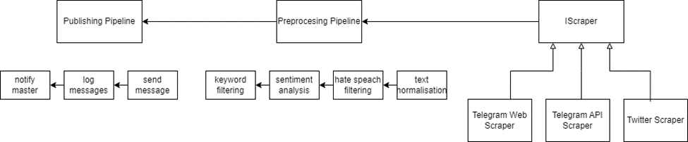

# Scraping Agent

The Scraping Agent is a Python-based microservice responsible for retrieving raw messages from various social media platforms like Telegram and Twitter. It supports both API-based and crawler-based extraction mechanisms.

This service acts as the first stage in the data processing pipeline, fetching messages in real-time or periodically, then performing initial cleaning, entity extraction, and enrichment before passing them downstream via Kafka.

## Key Responsibilities

- Executing scraping tasks (via APIs or crawlers)
- Preprocessing and enriching collected messages
- Publishing structured data to Kafka topics
- Managing scraper configurations and credentials via MongoDB

## Technologies Used

- **Language**: Python
- **Framework**: Flask
- **Queue**: Apache Kafka
- **Database**: MongoDB
- **NER**: HuggingFace models (e.g., mBERT)

